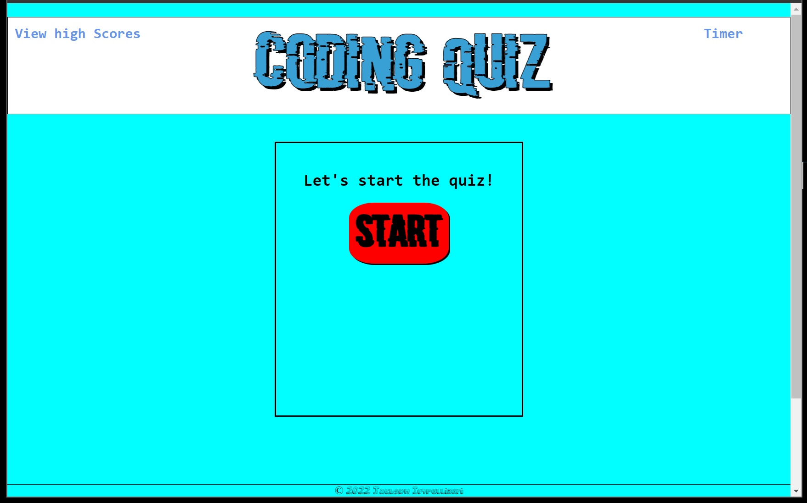

# coding-quiz

https://jaxpi.github.io/coding-quiz/
 

## Description

This application allows users to study javascript concepts and skills and compare their results to previous attempts and other users.

This was created to make studying javascript more interactive and enjoyable, and to get a sense of where the user stands in comparison to others or their previous attempts.

## Usage

The user clicks the start button to begin the quiz and is presented with the first question and 4 possible answers. The timer begins to count down from 60 seconds while the user determines which option to select. When the user selects an option the next question propagates and a message is displayed to let the user know if they got the previous answer correct or not. If the user is correct then a point is added to the correct answer tally, but if incorrect then time is removed from the countdown.

If time runs out or if all questions have been answered then the quiz is over and the user's total points are displayed along with an input box for them to enter their initials. If the user's score is one of the 3 highest in the local storage then their initials and score are added to the "high scores" hall of fame!

## License

MIT License

Copyright (c) 2022 Jackson Impellizeri

Permission is hereby granted, free of charge, to any person obtaining a copy
of this software and associated documentation files (the "Software"), to deal
in the Software without restriction, including without limitation the rights
to use, copy, modify, merge, publish, distribute, sublicense, and/or sell
copies of the Software, and to permit persons to whom the Software is
furnished to do so, subject to the following conditions:

The above copyright notice and this permission notice shall be included in all
copies or substantial portions of the Software.

THE SOFTWARE IS PROVIDED "AS IS", WITHOUT WARRANTY OF ANY KIND, EXPRESS OR
IMPLIED, INCLUDING BUT NOT LIMITED TO THE WARRANTIES OF MERCHANTABILITY,
FITNESS FOR A PARTICULAR PURPOSE AND NONINFRINGEMENT. IN NO EVENT SHALL THE
AUTHORS OR COPYRIGHT HOLDERS BE LIABLE FOR ANY CLAIM, DAMAGES OR OTHER
LIABILITY, WHETHER IN AN ACTION OF CONTRACT, TORT OR OTHERWISE, ARISING FROM,
OUT OF OR IN CONNECTION WITH THE SOFTWARE OR THE USE OR OTHER DEALINGS IN THE
SOFTWARE.